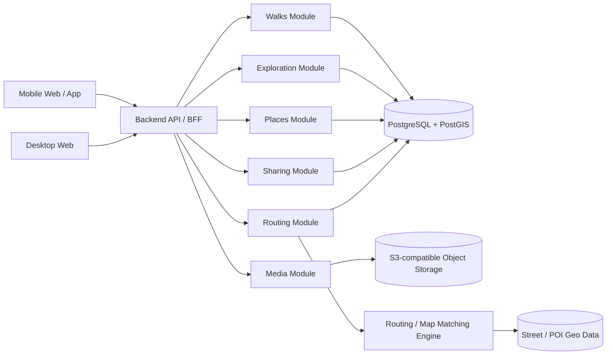
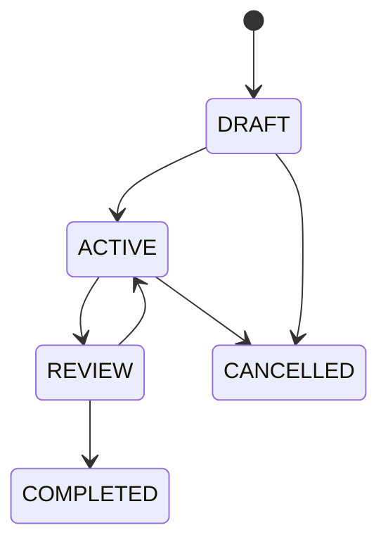

# ГуляЕм — Technical Design

**Status:** Draft v0.1  
**Purpose:** технический контекст и базовая архитектура проекта «ГуляЕм»  
**Scope:** MVP + ближайшие архитектурные расширения  
**Primary city for testing:** Санкт-Петербург  
**Architecture goal:** city-agnostic, mobile-first, privacy-first

---

# 1. Цели документа

Этот документ фиксирует техническую архитектуру «ГуляЕм» так, чтобы дальнейшие обсуждения реализации, API, хранения геоданных, мобильного клиента и recommendation engine опирались на единый контекст.

Документ сознательно разделяет:

- решения, которые желательно принять уже для MVP;
- capabilities, которые архитектура должна поддерживать, но которые можно реализовать позже;
- открытые вопросы, которые пока не блокируют разработку.

---

# 2. Ключевые технические требования

## 2.1. Street-level exploration

Основная уникальная capability продукта — определять, какие участки городской уличной сети пользователь уже прошёл.

Источник истины:

> **нормализованный маршрут, сопоставленный с графом улиц**

а не raw GPS trace.

---

## 2.2. Ненадёжный GPS

Для стартовой аудитории в РФ GPS нельзя считать достоверным источником маршрута.

Система должна поддерживать:

- ручное построение маршрута;
- импорт маршрута;
- GPS tracking;
- map matching;
- confidence / качество сопоставления;
- ручную коррекцию;
- повторную нормализацию маршрута.

Raw GPS должен сохраняться отдельно от нормализованного маршрута.

---

## 2.3. Mobile-first

Основной сценарий использования — мобильный.

Критические mobile capabilities:

- просмотр карты;
- построение маршрута;
- активная прогулка;
- добавление Place;
- добавление фото;
- завершение и коррекция маршрута.

Background GPS tracking — отдельная capability и не должен блокировать первый MVP.

---

## 2.4. City-agnostic architecture

Хотя первый город — Санкт-Петербург, доменная модель не должна содержать SPb-specific assumptions.

Все пространственные данные должны быть привязаны к `city_id`, геометрии или общим административным сущностям.

---

## 2.5. Privacy-first

По умолчанию:

- маршруты приватны;
- посещения приватны;
- фотографии приватны;
- комментарии приватны.

Sharing реализуется явно и отдельно.

---

# 3. Архитектурный стиль

Для MVP рекомендуется **modular monolith**.

Причины:

- небольшая команда;
- высокая связность доменных операций;
- необходимость транзакционной консистентности между Walk, Route и Exploration;
- низкая ценность раннего service decomposition;
- проще локальная разработка и deployment.

Логические модули должны иметь чёткие границы, чтобы позже при необходимости их можно было вынести в отдельные сервисы.

Предлагаемые модули:

```text
Identity
Map / Geo
Routing
Walks
Exploration
Places
Media
Sharing
Recommendations (later)
Import / Tracking (later)
```

---

# 4. High-level architecture



---

# 5. Recommended infrastructure baseline

## 5.1. Primary database

**PostgreSQL + PostGIS**

Причины:

- хранение LineString / MultiLineString / Point / Polygon;
- spatial indexes;
- point-in-polygon;
- distance / intersection queries;
- работа с районами;
- сопоставление маршрута с сегментами;
- proximity search для Place.

PostgreSQL остаётся основной транзакционной БД.

Отдельная NoSQL БД для MVP не требуется.

---

## 5.2. Object storage

S3-compatible storage для:

- фотографий;
- импортированных GPX;
- при необходимости raw tracking archives;
- generated previews.

В БД хранится только metadata и object key.

---

## 5.3. Map rendering

Клиенту нужен векторный map renderer с возможностью:

- custom style;
- overlays;
- highlighted street segments;
- route layers;
- photo / place markers;
- district polygons.

Конкретный map SDK / renderer фиксируется отдельным ADR.

---

## 5.4. Routing engine

Routing не следует писать самостоятельно.

Нужен внешний или self-hosted routing engine, поддерживающий pedestrian routing.

Желательные capabilities:

- route by waypoints;
- walking profile;
- route geometry;
- snapping;
- желательно map matching;
- возможность self-hosting;
- работа на open geodata.

Конкретный движок выбирается отдельно после spike.

---

# 6. Основная доменная модель

## 6.1. City

```text
City
- id
- name
- country_code
- timezone
- boundary
- data_version
```

---

## 6.2. District

```text
District
- id
- city_id
- external_id
- name
- boundary
- kind
```

`kind` позволяет в будущем поддерживать разные уровни административного деления.

---

## 6.3. Street

```text
Street
- id
- city_id
- external_id
- name
- normalized_name
```

Street — логическая сущность.

Exploration не должен храниться на уровне Street.

---

## 6.4. StreetSegment

```text
StreetSegment
- id
- city_id
- street_id?
- external_id?
- geometry
- length_m
- pedestrian_access
- source_version
```

`StreetSegment` — основная единица exploration.

Сегмент должен быть достаточно стабильным в рамках версии геоданных.

---

## 6.5. Route

```text
Route
- id
- user_id
- city_id
- source_type
- geometry
- distance_m
- created_at
- source_metadata
- geo_data_version
```

`source_type`:

```text
MANUAL
GPS
GPX
EXTERNAL
CORRECTED_GPS
```

---

## 6.6. RouteSegmentMatch

Связь нормализованного Route с street graph.

```text
RouteSegmentMatch
- route_id
- street_segment_id
- order_index
- matched_length_m
- confidence?
```

Это позволяет:

- вычислять exploration;
- пересчитывать маршрут;
- анализировать overlap;
- не выполнять дорогой GIS match каждый раз.

---

## 6.7. Walk

```text
Walk
- id
- user_id
- city_id
- route_id
- status
- started_at
- finished_at
- duration_sec
- distance_m
- comment
- created_at
```

Статусы:

```text
DRAFT
ACTIVE
REVIEW
COMPLETED
CANCELLED
```

---

## 6.8. UserStreetProgress

```text
UserStreetProgress
- user_id
- street_segment_id
- first_visited_at
- last_visited_at
- visit_count
- explored_length_m
```

Для MVP `explored_length_m` может быть равен полной длине сегмента после достижения порога покрытия.

Позже можно перейти к более точной модели частичного покрытия.

---

## 6.9. ExplorationDelta

Snapshot результата конкретной прогулки.

```text
ExplorationDelta
- walk_id
- new_segments_count
- new_length_m
- created_at
```

Дополнительно:

```text
WalkDistrictDelta
- walk_id
- district_id
- percentage_before
- percentage_after
- new_length_m
```

Это позволяет воспроизводить Walk Summary без пересчёта исторического состояния.

---

# 7. Exploration algorithm

## 7.1. Input

На вход:

```text
Normalized Route
+
RouteSegmentMatch[]
+
Existing UserStreetProgress
```

---

## 7.2. MVP algorithm

Для каждого matched street segment:

1. определить длину overlap маршрута с сегментом;
2. сравнить с минимальным threshold;
3. считать сегмент исследованным, если threshold достигнут;
4. проверить, был ли сегмент уже исследован пользователем;
5. записать `UserStreetProgress`;
6. сформировать `ExplorationDelta`.

Упрощённо:

```text
route
  ↓
matched segments
  ↓
coverage threshold
  ↓
new / already explored
  ↓
persist progress
```

---

## 7.3. Почему не считать просто количество улиц

Улицы сильно отличаются по длине.

Поэтому процент района рекомендуется считать по длине walkable network:

```text
exploration_percentage =
explored_walkable_length /
total_walkable_length
```

---

## 7.4. Open decision: coverage threshold

Нужно отдельное решение:

- сколько метров сегмента достаточно пройти;
- использовать абсолютный threshold;
- использовать процент длины;
- комбинировать оба.

Начальный вариант:

```text
explored =
covered_length >= min(segment_length * ratio, max_threshold)
```

Конкретные коэффициенты должны быть проверены на реальных данных Петербурга.

---

# 8. Geo data lifecycle

Уличный граф изменяется со временем.

Поэтому маршруты и сегменты должны быть version-aware.

```text
GeoDataVersion
- id
- city_id
- source
- imported_at
- checksum
```

`Route` сохраняет `geo_data_version`.

Это требуется для корректной обработки:

- переименований;
- разделения segment;
- объединения segment;
- появления новых улиц;
- закрытия проходов.

---

# 9. Обновление street graph

Нельзя считать `StreetSegment.id` вечным идентификатором.

При обновлении геоданных нужен процесс миграции exploration state.

Возможные стратегии:

### MVP
Редкие контролируемые обновления + пересчёт пользовательского прогресса на основе сохранённых Route geometry.

### Later
Segment lineage / spatial reconciliation между версиями.

Критически важно сохранять geometry завершённых маршрутов, чтобы exploration можно было восстановить.

---

# 10. Manual Route Builder

Manual routing — основной надёжный способ создания прогулки в MVP.

Client хранит waypoints:

```text
Waypoint[]
- lat
- lon
- order
- place_id?
```

Backend / routing engine возвращает:

```text
RoutePreview
- geometry
- distance
- duration
- new_length
- new_percentage
```

Flow:

```text
waypoints
   ↓
routing engine
   ↓
route geometry
   ↓
street segment matching
   ↓
exploration preview
```

---

# 11. Route Preview

Preview не должен создавать постоянный Walk.

API должен позволять дешёво пересчитывать маршрут при перемещении waypoint.

Пример:

```text
POST /route-previews
```

Request:

```json
{
  "cityId": "...",
  "waypoints": [
    {"lat": 59.0, "lon": 30.0},
    {"lat": 59.1, "lon": 30.1}
  ],
  "profile": "walking"
}
```

Response:

```json
{
  "geometry": "...",
  "distanceMeters": 4200,
  "durationSeconds": 3600,
  "exploration": {
    "newMeters": 2800,
    "newRatio": 0.67
  }
}
```

Формат geometry следует выбрать отдельно: encoded polyline, GeoJSON или другой компактный transport format.

---

# 12. Walk lifecycle



### DRAFT
Маршрут создан, прогулка ещё не начата.

### ACTIVE
Прогулка идёт.

### REVIEW
Пользователь завершил прогулку и проверяет фактический маршрут.

### COMPLETED
Маршрут подтверждён, exploration рассчитан.

### CANCELLED
Прогулка отменена.

---

# 13. Completing a Walk

Операция завершения должна быть транзакционно устойчивой.

Логика:

```text
Walk(REVIEW)
   ↓
final route confirmed
   ↓
route normalized
   ↓
segment matching
   ↓
exploration delta calculated
   ↓
progress persisted
   ↓
Walk(COMPLETED)
```

Желательно делать это идемпотентной backend operation.

Например:

```text
POST /walks/{id}/complete
```

Повторный запрос не должен повторно увеличивать progress.

---

# 14. Route correction

Correction должна создавать новую версию маршрута либо заменять DRAFT/REVIEW route до completion.

После `COMPLETED` изменение маршрута становится более сложной операцией:

1. снять contribution старого route;
2. сохранить новый route;
3. пересчитать exploration пользователя;
4. пересчитать affected walks / district statistics.

Для MVP возможен более простой подход:

> изменение маршрута завершённой прогулки запускает полный пересчёт exploration пользователя по всем завершённым Walk.

Это дороже, но сильно упрощает корректность.

---

# 15. GPS tracking — future capability

Raw GPS:

```text
GpsTrackPoint
- walk_id
- recorded_at
- lat
- lon
- accuracy?
- speed?
- altitude?
```

Raw GPS никогда напрямую не обновляет exploration.

Pipeline:

```text
Raw GPS
   ↓
noise filtering
   ↓
map matching
   ↓
candidate normalized route
   ↓
user review/correction
   ↓
final route
   ↓
exploration
```

---

# 16. GPS confidence

В будущем каждому участку matched route можно присваивать confidence.

```text
RouteCandidateSegment
- geometry
- confidence
- source_points_count
```

Low-confidence segments выделяются на Route Review.

Это лучше, чем сообщать пользователю общую абстрактную «GPS accuracy».

---

# 17. Place domain

## Place

```text
Place
- id
- city_id
- source
- external_id?
- owner_user_id?
- name
- category
- location
- created_at
```

`source`:

```text
EXTERNAL
USER
```

Пользовательские Place могут оставаться приватными.

---

## Visit

```text
Visit
- id
- user_id
- place_id
- walk_id?
- visited_at
- rating?
- comment?
- created_at
```

Visit существует независимо от наличия review.

---

# 18. Place detection

Автоматическое предложение Place во время прогулки — heuristic capability.

Необходимо учитывать:

- GPS uncertainty;
- расстояние;
- длительность нахождения рядом;
- planned waypoint;
- manual confirmation.

Система не должна автоматически создавать Visit без подтверждения пользователя в сомнительных случаях.

---

# 19. Photos / Media

Metadata:

```text
Photo
- id
- user_id
- walk_id?
- visit_id?
- object_key
- captured_at?
- location?
- created_at
```

Upload flow рекомендуется делать через presigned upload URL:

```text
client
 ↓
request upload
 ↓
backend
 ↓
presigned URL
 ↓
client → object storage
 ↓
confirm metadata
```

Это не заставляет backend проксировать большие файлы.

---

# 20. Sharing

Sharing отделён от visibility самой сущности.

```text
Share
- id
- owner_user_id
- resource_type
- resource_id
- token
- expires_at?
- revoked_at?
- settings
```

Пример settings:

```json
{
  "showRoute": true,
  "showPlaces": true,
  "showPhotos": true,
  "showComments": true,
  "hideRouteEndpoints": true
}
```

---

# 21. Hiding route endpoints

Перед sharing можно создавать public projection маршрута.

Пример:

```text
original route:
A ================= B

shared route:
    =============
```

Удаляется заданный radius / distance около первой и последней точки.

Оригинальная geometry не изменяется.

---

# 22. API architecture

Клиент должен работать через единый backend API.

Для MVP не требуется публично разделять внутренние модули.

Предварительные capability groups:

```text
/auth
/map
/routes
/walks
/exploration
/places
/visits
/media
/shares
```

---

# 23. Initial REST surface

Примерный контракт, не финальный API design.

## Exploration

```text
GET /cities/{cityId}/exploration
GET /districts/{districtId}/exploration
```

## Route

```text
POST /route-previews
POST /routes
GET  /routes/{id}
PUT  /routes/{id}
```

## Walk

```text
POST /walks
GET  /walks
GET  /walks/{id}
POST /walks/{id}/start
POST /walks/{id}/finish
PUT  /walks/{id}/route
POST /walks/{id}/complete
```

## Places

```text
GET  /places/nearby
POST /places
GET  /places/{id}
```

## Visits

```text
POST /places/{id}/visits
PATCH /visits/{id}
DELETE /visits/{id}
```

## Media

```text
POST /media/uploads
POST /media
DELETE /media/{id}
```

## Sharing

```text
POST /shares
GET  /shared/{token}
DELETE /shares/{id}
```

---

# 24. Map API

Не нужно отправлять клиенту всю уличную сеть города вместе с user progress.

Следует отдавать данные по viewport / tiles.

Возможные подходы:

1. vector tiles;
2. bbox API;
3. hybrid.

Для exploration map предпочтителен tile-based подход при росте объёма данных.

Для раннего MVP допустим bbox API, если объём Петербурга и количество клиентских запросов остаются контролируемыми.

---

# 25. Spatial indexes

Минимально потребуются:

- GiST / SP-GiST indexes на geometry;
- index по `city_id`;
- composite indexes для user progress;
- spatial index для Place;
- spatial index для District boundary.

Примеры логических запросов:

```text
segments intersecting route
places near point
district containing point
segments in viewport
```

---

# 26. Caching

Не стоит начинать с Redis по умолчанию.

Сначала измерить.

Наиболее вероятные кандидаты для cache:

- routing previews;
- district statistics;
- map tiles;
- external POI data;
- static city metadata.

User-specific exploration state требует аккуратной invalidation.

---

# 27. Background jobs

Для MVP большинство операций может выполняться синхронно.

Background jobs понадобятся для:

- import geo datasets;
- обновление street graph;
- reconciliation после geo update;
- photo processing;
- full exploration rebuild;
- GPX import;
- recommendation generation;
- большие map-matching задачи.

Можно начинать с простой DB-backed job queue или отдельного worker process.

---

# 28. Consistency model

Следующие операции требуют сильной консистентности:

- Walk completion;
- exploration update;
- изменение завершённого Walk;
- удаление Walk;
- Visit ownership;
- Share visibility.

Recommendation и map analytics могут быть eventually consistent.

---

# 29. Rebuildability

Важный архитектурный принцип:

> **Exploration progress должен быть производным состоянием, которое можно восстановить из завершённых Walk.**

Поэтому необходимо хранить:

- final geometry каждого Walk;
- route-to-segment match либо возможность его воспроизвести;
- geo data version.

`UserStreetProgress` — материализованное состояние для быстрых чтений.

Это защищает от ошибок алгоритма и изменений street graph.

---

# 30. Delete / edit semantics

## Delete Walk

MVP semantics:

1. Walk переводится в deleted / удаляется логически;
2. запускается rebuild exploration пользователя;
3. связанные Visits и Photos обрабатываются согласно выбранной ownership policy.

Рекомендуется soft delete для Walk.

---

## Edit completed Walk

Также запускает rebuild exploration.

Для небольшого числа пользовательских прогулок это приемлемо.

Позже можно оптимизировать incremental recalculation.

---

# 31. Authentication

Конкретный identity provider пока не определён.

Требования:

- user account;
- refresh/session management;
- mobile/web support;
- возможность позже добавить social login;
- backend ownership authorization.

Identity не должен проникать в geo domain кроме `user_id`.

---

# 32. Authorization

Все user-owned entities должны проверяться по ownership:

```text
Route
Walk
Visit
Photo
User Place
Share
```

Shared endpoint использует отдельную public projection и не должен обходить обычный authorization layer.

---

# 33. Threat / privacy considerations

Особенно чувствительные данные:

- история перемещений;
- начало и конец маршрутов;
- фотографии с metadata;
- пользовательские места;
- повторяемые маршруты.

Требования:

- private by default;
- минимизация публичных данных;
- revoke share;
- endpoint hiding;
- удаление EXIF GPS при публичной отдаче фотографии, если оно не требуется;
- контроль доступа к object storage;
- short-lived upload/download credentials.

---

# 34. Observability

Минимум:

## Metrics
- API latency;
- route preview latency;
- route matching latency;
- walk completion latency;
- DB query latency;
- error rate;
- photo upload failures.

## Logs
Структурированные, с correlation/request id.

Не логировать raw GPS и точные координаты без необходимости.

## Tracing
Особенно полезен flow:

```text
API
→ routing
→ spatial queries
→ exploration calculation
```

---

# 35. Performance targets for MVP

Начальные engineering targets, не SLA:

### API
p95 обычных CRUD requests < 500 ms.

### Route preview
желательно < 1–2 sec для интерактивного UX.

### Walk completion
желательно < 2 sec;
если тяжелее — asynchronous processing с понятным UI.

### Map interaction
client rendering должен оставаться плавным при typical city viewport.

---

# 36. Offline / bad network

Mobile-first продукт должен учитывать плохую связь.

MVP желательно поддержать:

- сохранение текущего route locally;
- сохранение unfinished Walk locally;
- retry mutation;
- локальную очередь photo metadata;
- idempotency keys для критичных mutation.

Полноценный offline map не обязателен для первого MVP.

---

# 37. Idempotency

Обязательные кандидаты:

```text
start walk
finish walk
complete walk
create visit
photo metadata confirmation
```

Клиент может повторить запрос после network timeout.

---

# 38. Client state

Рекомендуется разделить:

### Server state
- walks;
- places;
- exploration;
- routes.

### Ephemeral map state
- selected waypoint;
- viewport;
- temporary route preview;
- selected place;
- correction edits.

### Durable local state
- active walk id;
- unsent changes;
- offline queue.

---

# 39. Platform strategy

Первый vertical slice можно реализовать как mobile-first web application.

Но platform decision нельзя считать закрытым до spike background tracking.

Нужно отдельно сравнить:

- responsive web;
- PWA;
- cross-platform mobile;
- native iOS/Android.

Критерии:

- background location;
- battery;
- offline;
- camera/photo integration;
- push;
- map performance;
- distribution constraints;
- скорость разработки.

---

# 40. Deployment

MVP может быть развернут как:

```text
Reverse Proxy
    ↓
Backend API
    ↓
PostgreSQL/PostGIS

Routing Engine
Object Storage
Worker
```

Не требуется Kubernetes, если нагрузка и эксплуатационные требования этого не оправдывают.

Контейнеризация желательна.

---

# 41. Geo import pipeline

Предварительный pipeline:

```text
source geo data
   ↓
download
   ↓
validate
   ↓
extract city boundary
   ↓
build walkable network
   ↓
normalize streets
   ↓
generate StreetSegments
   ↓
assign District
   ↓
publish GeoDataVersion
```

Import должен быть reproducible.

---

# 42. Recommendation engine — future architecture

Recommendation не должен менять core domain.

Он читает:

```text
UserStreetProgress
Saved Places
Visits
Route history
Current location / selected start
Constraints
```

и выдаёт:

```text
CandidateRoute[]
```

Пример constraints:

```text
duration <= 80 min
new_street_ratio >= 0.70
include coffee place
return_to_start = true
```

Routing core остаётся тем же.

---

# 43. Candidate route scoring

Будущий score может учитывать:

```text
new street coverage
distance
duration
place relevance
route diversity
repeated streets penalty
user preferences
walkability
```

Это отдельный модуль и не должен быть встроен в exploration calculation.

---

# 44. Social layer — future architecture

Social не должен делать private domain публичным напрямую.

Нужны отдельные public projections:

```text
SharedWalk
SharedPlace
PublicCollection
```

Это позволяет:

- удалять приватные поля;
- скрывать endpoints;
- модерировать public content;
- независимо кэшировать.

---

# 45. Suggested repository structure

Если backend реализован одним приложением:

```text
/cmd
/internal
  /identity
  /geo
  /routing
  /walks
  /exploration
  /places
  /media
  /sharing
  /recommendations
/pkg
/migrations
/deploy
/docs
```

Точная структура зависит от выбранного языка, но модульные границы желательно сохранить.

---

# 46. Первый technical vertical slice

## Scope

Реализовать:

```text
Map
→ Manual Route
→ Walk
→ Finish
→ Route Review
→ Segment Matching
→ Exploration Delta
→ Summary
→ Updated Map
```

---

## Backend minimum

Нужны:

- City;
- District;
- StreetSegment;
- Route;
- RouteSegmentMatch;
- Walk;
- UserStreetProgress;
- ExplorationDelta.

---

## Infrastructure minimum

- PostgreSQL + PostGIS;
- map renderer;
- routing engine;
- backend API.

---

## Не входит

- GPS tracking;
- GPX;
- photos;
- Place;
- Visit;
- sharing;
- recommendations;
- social.

---

# 47. Вторая technical iteration

Добавить:

```text
Place
Visit
Photo
Walk journal
```

Capabilities:

- user Place;
- nearby Place;
- place in route;
- Visit;
- rating/comment;
- photo upload;
- Walk Detail.

---

# 48. Третья technical iteration

Добавить capture sources:

```text
GPS
GPX
External imports
Map matching
Route confidence
Correction UX
```

---

# 49. Четвёртая technical iteration

Recommendation engine:

```text
Where should I walk today?
```

Сначала heuristic generation без ML.

---

# 50. Основные архитектурные риски

## 50.1. Street graph stability

Изменение исходных геоданных может разрушить идентичность сегментов.

Mitigation:
- geometry сохранённых Walk;
- geo version;
- rebuildable exploration.

---

## 50.2. Route matching quality

Особенно при GPS spoofing.

Mitigation:
- GPS не источник истины;
- confidence;
- manual review;
- manual route fallback.

---

## 50.3. Exploration semantics

Если пользователю непонятно, почему улица считается или не считается исследованной, игровая механика ломается.

Mitigation:
- простая формула;
- визуально понятные сегменты;
- возможность объяснить результат;
- тестирование на реальных прогулках.

---

## 50.4. Map performance

Большое количество segment overlay может стать тяжёлым.

Mitigation:
- vector tiles / viewport loading;
- server-side aggregation;
- geometry simplification по zoom.

---

## 50.5. Privacy

История маршрутов потенциально раскрывает дом и рутину пользователя.

Mitigation:
- private by default;
- explicit sharing;
- endpoint hiding;
- public projections.

---

# 51. ADR backlog

Следующие решения желательно оформить отдельными ADR:

1. **ADR-001:** mobile platform: web/PWA/cross-platform/native.
2. **ADR-002:** map renderer.
3. **ADR-003:** routing / map matching engine.
4. **ADR-004:** geo data source.
5. **ADR-005:** StreetSegment generation strategy.
6. **ADR-006:** exploration coverage formula.
7. **ADR-007:** identity/auth approach.
8. **ADR-008:** media/object storage.
9. **ADR-009:** map delivery: bbox vs vector tiles.
10. **ADR-010:** background jobs implementation.

---

# 52. Open technical questions

## Geo
- Какой источник street/POI data использовать?
- Как стабильно формировать StreetSegment?
- Как обрабатывать pedestrian-only paths?
- Включать ли дворовые проходы?
- Как учитывать мосты, тоннели и многоуровневые дороги?

## Exploration
- Какой threshold покрытия сегмента?
- Нужна ли частичная exploration?
- Как считать площадь/процент района?
- Что происходит после изменения street graph?

## Routing
- Какой engine использовать?
- Нужен ли self-hosting с первого дня?
- Какой routing profile считать базовым?
- Где выполнять map matching?

## Client
- PWA или mobile application?
- Как работать с background location?
- Что сохранять offline?
- Как организовать route correction UX?

## Storage
- Как хранить route geometry?
- Нужны ли vector tiles сразу?
- Когда понадобится cache?

---

# 53. Принципы, которые не следует нарушать

1. **Raw GPS ≠ route truth.**
2. **Route ≠ Walk.**
3. **Place ≠ Visit.**
4. **Exploration — производное, rebuildable состояние.**
5. **StreetSegment — единица exploration, а не целая Street.**
6. **Privacy by default.**
7. **Mobile-first, но не fitness-first.**
8. **Не вводить microservices без эксплуатационной необходимости.**
9. **Не писать собственный routing engine.**
10. **Recommendation engine должен использовать core domain, а не заменять его.**

---

# 54. Краткая архитектурная формулировка

> «ГуляЕм» хранит завершённые прогулки как нормализованные маршруты по городской уличной сети. Из этих маршрутов вычисляется персональное состояние исследования города. GPS, ручное построение и импорт являются только различными источниками маршрута. Вокруг этого ядра строятся Places, Visits, Photos, Sharing и позднее Recommendation Engine.
